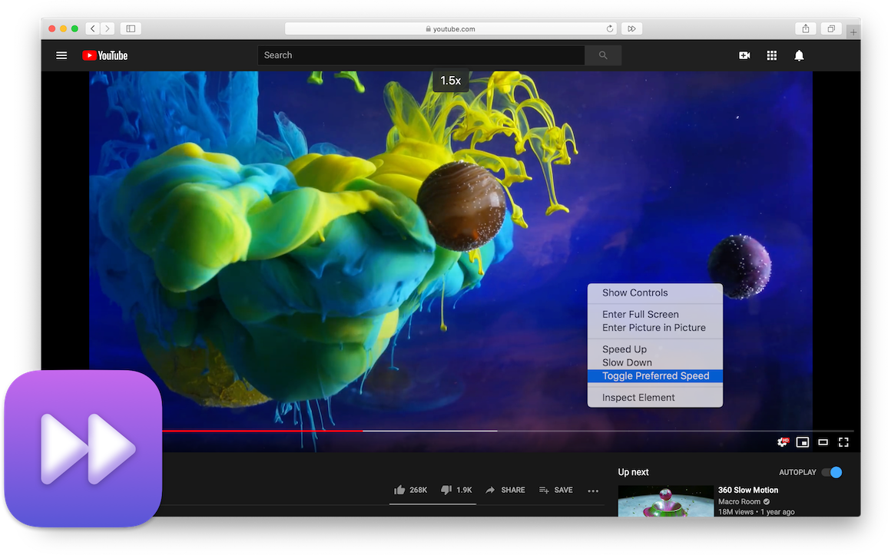

# Accelerate for Safari

### Customizable controls for video playback

  
  
Requires macOS 10.11+

 

---

 

### Control video speed

Customizable keyboard shortcuts allow you to instantly speed up and slow down videos on any video website, or toggle between different speed settings.

### Convenient playback shortcuts

Add convenient playback shortcuts that work across your favorite video websites, allowing you to easily toggle Picture-in-Picture or skip video ads.

### Extensive website support

Accelerate supports any website that uses HTML5 video, including YouTube, Netflix, Hulu, and more.

