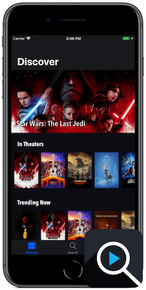

  

    <h1>CineSearch</h1>
    <h2>Discover and search for the latest movies</h2>
    <ul style="line-height: 1.5rem">
      <li>Browse movies in theaters and trending right now</li>
      <li>Discover new films to watch based on your favorites</li>
      <li>Search by title for the latest releases or timeless classics</li>
      <li>View plot summaries, ratings, trailers, cast info, and more</li>
    </ul>
    
  

  

    
  

