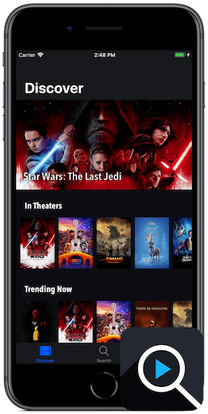

  
  

    <h1>CineSearch</h1>
    <h2>The best way to discover movies</h2>
    <li>Discover new films based on your favorites</li>
    <li>Search for the latest releases or timeless classics</li>
    <li>View plot summaries, ratings, trailers, and more</li>
     
    
  

